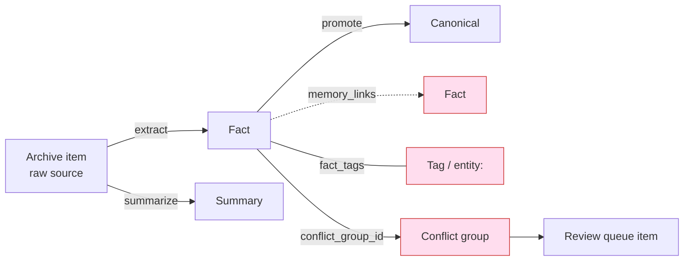
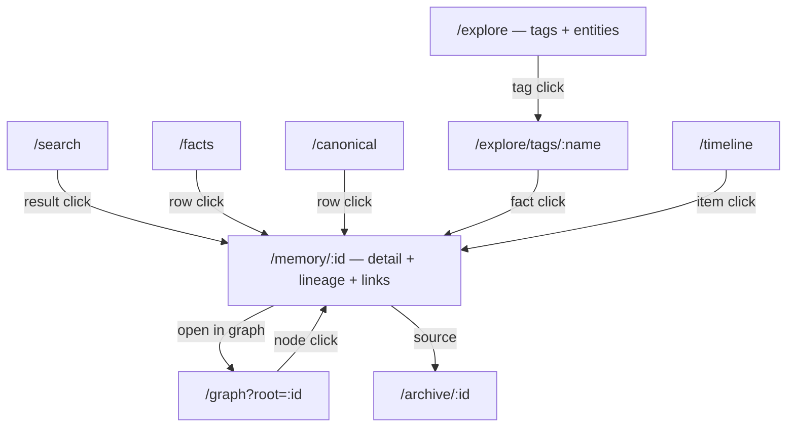
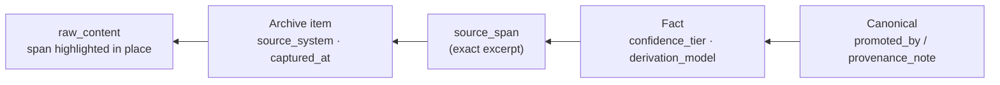

# Memory Visualization & Traversal — Design Proposal

**Status:** Proposal · **Date:** 2026-07-22 · **Scope:** Frontend (`frontend/`), with supporting backend endpoints

## What we're building

Recalium already stores a **connected knowledge graph** — facts linked by typed
edges, tagged with entities, clustered into conflict groups, each traceable back
to the exact source text it came from. The current UI renders that graph as
**eight flat, disconnected lists**. This proposal turns the UI into something you
can actually *traverse*: click a fact and follow it to its related facts, its
tags, its conflicts, its canonical promotion, and its source — and, at the top
end, see the whole neighborhood as an interactive graph.

### Goals

- Make every memory item **addressable** (deep-linkable) and **connected**
  (every relationship is a click, not a dead end).
- Surface the relationship data the backend already computes but the frontend
  never calls: **tags**, **memory links**, **conflict groups**, **provenance chains**.
- Give users more than one lens on their memory: **list**, **detail/lineage**,
  **graph**, **timeline**.
- Keep it fast, keyboard-navigable, and honest about degraded mode.

### Non-goals (stay inside v1 constraints)

Per [CLAUDE.md](../../CLAUDE.md): single-user, local-first, two containers
(`recalium-app` + `recalium-postgres`). This proposal adds **no new container**,
no auth system, and no multi-tenant concepts. Graph rendering is a client-side
library plus at most one new read endpoint — no graph database.

## Current-state audit

### The eight pages

Navigation ([frontend/src/components/NavSidebar.tsx](../../frontend/src/components/NavSidebar.tsx))
routes to eight isolated pages, each a standalone CRUD list:

| Page | File | What it shows | Cross-links? |
|------|------|---------------|--------------|
| Ingest | [IngestPage.tsx](../../frontend/src/pages/IngestPage.tsx) | paste/upload/import | — |
| Archive | [ArchivePage.tsx](../../frontend/src/pages/ArchivePage.tsx) | raw source items | none |
| Facts | [FactsPage.tsx](../../frontend/src/pages/FactsPage.tsx) | extracted facts | none (conflict badge is static) |
| Canonical | [CanonicalPage.tsx](../../frontend/src/pages/CanonicalPage.tsx) | promoted facts | none |
| Search | [SearchPage.tsx](../../frontend/src/pages/SearchPage.tsx) | retrieval results | "Source" opens raw text inline |
| Review Queue | [ReviewQueuePage.tsx](../../frontend/src/pages/ReviewQueuePage.tsx) | conflict groups | none |
| Audit | [AuditPage.tsx](../../frontend/src/pages/AuditPage.tsx) | audit events | none |
| Settings | [SettingsPage.tsx](../../frontend/src/pages/SettingsPage.tsx) | BYOK keys | — |

The single richest interaction is the **Source** button in
[SearchPage.tsx](../../frontend/src/pages/SearchPage.tsx) that expands the raw
archive text inline. Everything else is a terminal list.

### The graph the UI ignores

The backend computes and stores a real graph, but
[frontend/src/lib/api.ts](../../frontend/src/lib/api.ts) makes **zero calls** to
the endpoints that expose it:



**Relationship data that exists in Postgres today:**

- **`memory_links`** ([migration 0005](../../backend/migrations/versions/0005_links_and_tags.py)) —
  directed, typed edges between two facts. Columns: `source_fact_id`,
  `target_fact_id`, `link_type`, `entity_name`, `confidence`, `created_by`.
  Link types produced by the worker
  ([dispatcher.py](../../backend/app/worker/dispatcher.py)):
  `supports`, `elaborates`, `contradicts`, `related`, and `entity` (co-mention
  pass — carries `entity_name`); `unrelated` is discarded.
- **`tags` / `fact_tags`** ([migration 0005](../../backend/migrations/versions/0005_links_and_tags.py)) —
  many-to-many labels, including `entity:`-prefixed entity tags.
- **`conflict_groups`** ([migration 0002](../../backend/migrations/versions/0002_derived_memory.py)) —
  facts sharing a `conflict_group_id`, surfaced only in the Review Queue.
- **Provenance chain** — `canonical.fact_id` → `fact.raw_archive_id` →
  `archive item.raw_content`, with `fact.source_span` marking the exact excerpt.

**Endpoints that already serve this — and are unused by the frontend:**

| Endpoint | Source | Used by FE? |
|----------|--------|-------------|
| `GET /api/tags` | [tags.py](../../backend/app/api/routes/tags.py) | ❌ |
| `GET /api/facts/{id}/tags` | [tags.py](../../backend/app/api/routes/tags.py) | ❌ |
| `GET /api/facts/{id}/links?direction=outgoing\|incoming\|both` | [tags.py](../../backend/app/api/routes/tags.py) | ❌ |
| MCP `get_fact_links`, `list_tags` | [mcp_server/server.py](../../backend/app/mcp_server/server.py) | (MCP clients only) |

**Diagnosis:** *Recalium stores a graph and shows lists.* The plumbing is done on
the server; the frontend simply never wires it up.

## Design principles

1. **Everything is addressable.** Any fact, canonical item, tag, or archive item
   has a URL (`/memory/:id`, `/explore/tags/:name`). Back/forward and deep links work.
2. **Everything is connected.** Every badge, entity, and source reference is a
   link. No terminal lists.
3. **Progressive disclosure.** Start from one item (an *ego view*); expand
   neighbors on demand. Never dump the whole graph.
4. **Keyboard-first & accessible.** The repo already ships `@axe-core/playwright`;
   traversal must work without a mouse, and the graph needs a list-based fallback.
5. **Honest degradation.** Reuse the existing `degraded_mode` signal; show when
   links/embeddings aren't ready yet instead of implying completeness.

## Information architecture

Add three route families; keep the existing pages but make their rows link into
the detail route.



Proposed nav grouping:

```
CAPTURE      REVIEW        EXPLORE          SYSTEM
· Ingest     · Facts       · Search         · Audit
· Archive    · Canonical   · Explore (tags) · Settings
             · Review Q    · Graph
                           · Timeline
```

## Tier 1 — Connected foundation

*No new dependencies. This is the highest-impact slice and builds the `api.ts`
plumbing that Tier 2 reuses.*

### 1.1 Memory detail view (`/memory/:id`)

A unified detail surface (drawer on wide screens, full page on narrow) that
works for a fact or a canonical item. It pulls the item plus its tags, its links
(both directions), its conflict group, and its lineage — turning one row into a
hub you can traverse from.

```
┌─ Memory · fact ────────────────────────────────────────── [Open in graph] ─┐
│ "User prefers pnpm over npm for all Node projects."                          │
│ [confidence: high] [active] [⚠ in conflict group]  via gpt-4o-mini          │
│                                                                              │
│ Tags:  #entity:pnpm   #entity:npm   #tooling           ← each links to      │
│                                                          /explore/tags/…     │
│ ┌ Related memory ──────────────────────────────────────────────────────┐   │
│ │ ⟶ supports    "Repo uses pnpm-lock.yaml"                    [open ›]   │   │
│ │ ⟶ elaborates  "pnpm chosen for strict hoisting"            [open ›]   │   │
│ │ ⟵ contradicts "User asked to switch to npm (2026-05)"  ⚠   [open ›]   │   │
│ └──────────────────────────────────────────────────────────────────────┘   │
│ ┌ Lineage ─────────────────────────────────────────────────────────────┐   │
│ │ Canonical ◂ Fact ◂ Summary ◂ Archive item (chatgpt · 2026-05-02)      │   │
│ │ Source span: "...let's standardize on pnpm..."  [view in source ›]    │   │
│ └──────────────────────────────────────────────────────────────────────┘   │
│ Actions: [Promote] [Mark disputed] [Mark stale] [Archive] [Delete]          │
└──────────────────────────────────────────────────────────────────────────────┘
```

Data sources (all read paths verified against backend):

- Item + fields → existing fact/canonical fields in [api.ts](../../frontend/src/lib/api.ts).
- Tags → `GET /api/facts/{id}/tags` ([tags.py](../../backend/app/api/routes/tags.py)).
- Links → `GET /api/facts/{id}/links?direction=both` ([tags.py](../../backend/app/api/routes/tags.py));
  each link carries `link_type`, `confidence`, `entity_name`, `other_fact_id`,
  `other_fact_text`.
- Source span highlight → `GET /api/archive/{raw_archive_id}` (`raw_content`) +
  `fact.source_span`.

### 1.2 Explore: tags & entities (`/explore`)

The tag system is completely invisible today. Add a browsable index that
separates **entities** (`entity:` prefix) from **topical tags**, sized by usage.

```
┌─ Explore ────────────────────────────────────────────────────────────────┐
│ [ Entities ] [ Topics ]            search tags: [__________]              │
│                                                                           │
│ Entities                                                                  │
│   pnpm ·23    Recalium ·41    Postgres ·18    Docker ·12    MCP ·9        │
│   (size / weight reflects fact_count)                                     │
│                                                                           │
│ Topics                                                                    │
│   tooling ·31   deployment ·22   retrieval ·15   security ·11            │
└───────────────────────────────────────────────────────────────────────────┘
        │ click "pnpm"
        ▼
┌─ /explore/tags/entity:pnpm ──────────────────────────────────────────────┐
│ 23 facts tagged entity:pnpm                       [see in graph ›]        │
│ • "User prefers pnpm over npm…"           [high] [active]      [open ›]   │
│ • "Repo uses pnpm-lock.yaml"              [med]  [active]      [open ›]   │
│ • …                                                                       │
└───────────────────────────────────────────────────────────────────────────┘
```

Data: `GET /api/tags` (has `name`, `fact_count`). **New:** a "facts for tag"
read path is needed (see [API additions](#api-additions)).

### 1.3 Provenance / lineage view

Formalize the ad-hoc "Source" panel into a full derivation chain with the exact
span highlighted — the "source viewer that highlights the span and shows the full
derivation chain" already called for in the recommendations set.



### 1.4 Cross-link the existing pages

Small, high-leverage edits so the current lists feed the detail route:

- [SearchPage.tsx](../../frontend/src/pages/SearchPage.tsx): result → `/memory/:id`;
  keep "Source" but route it through the lineage view.
- [FactsPage.tsx](../../frontend/src/pages/FactsPage.tsx): the static `conflict`
  badge becomes a link to the conflict group / Review Queue item.
- [CanonicalPage.tsx](../../frontend/src/pages/CanonicalPage.tsx): show and link
  the originating fact + source.

## Tier 2 — Interactive knowledge graph

*Adds one visualization dependency. Delivers the "wow" and the fastest way to
spot contradictions.*

### 2.1 Ego-graph explorer (`/graph?root=:id`)

Render the neighborhood **around one node**, expand outward on click. Never load
the global graph (it neither scales nor reads well at personal-memory sizes).

```
┌─ Graph · root: "prefers pnpm" ───────────────── depth [1] [2]  [reset] ─┐
│  legend:  ── supports(green)  ── elaborates(blue)  ── contradicts(red)   │
│           ·· related(grey)     ══ entity/co-mention(violet)              │
│                                                                          │
│            (Repo uses pnpm-lock) ──supports──▶ ● prefers pnpm ●          │
│                     ▲                          │      ▲                  │
│                 elaborates                  contradicts related          │
│                     │                          ▼      │                  │
│            (strict hoisting)          (switch to npm) (Node tooling)     │
│                                                                          │
│  ▸ click a node → expand its neighbors    ▸ double-click → open detail   │
└──────────────────────────────────────────────────────────────────────────┘
```

Interaction model:

- **Nodes** = facts / canonical items (entities optionally as a second node
  shape). **Edges** = `memory_links`, colored by `link_type`, opacity by
  `confidence`.
- Click a node → fetch its neighbors and expand. Double-click → open
  `/memory/:id`.
- Filter by link type (e.g. show only `contradicts`).
- **Accessibility fallback:** the same neighborhood as a nested list (the Tier‑1
  "Related memory" panel *is* that fallback), so the view is usable without the
  canvas.

### 2.2 Contradiction map

A preset of the graph filtered to `contradicts` edges + `conflict_groups`, wired
to the Review Queue so "resolve" is one hop away. This makes the memory's
internal disagreements visible instead of buried on one page.

### 2.3 Library evaluation

| Library | Rendering | Pros | Cons | Fit |
|---------|-----------|------|------|-----|
| `react-force-graph` | Canvas/WebGL | Easy force layout, handles 100s–1000s of nodes, zoom/pan built-in | Less control over custom node UI | **Recommended** — matches ego-graph, low effort |
| `cytoscape` (+ `react-cytoscapejs`) | Canvas | Rich graph algorithms, mature | Heavier API, larger bundle | If we later need pathfinding/analytics |
| `@xyflow/react` (React Flow) | DOM/SVG | Beautiful custom nodes, great a11y story | Manual layout; not built for force graphs | If nodes need rich inline UI over big graphs |

**Recommendation:** `react-force-graph` for the ego/contradiction views. Revisit
`cytoscape` only if graph *analytics* (shortest path, centrality) become a
feature.

## Tier 3 — Alternative structured views

### 3.1 Timeline (`/timeline`)

Memories along `captured_at`, filterable by `source_system`. Answers "what did I
learn, and when" and makes stale knowledge visible.

```
┌─ Timeline ──────────────── source: [all ▾]  type: [facts ▾] ────────────┐
│ 2026-05 ─●─●──────●────────────────────●──                              │
│           │ │      │                    └ "switch to npm"  ⚠ contradicts │
│           │ │      └ "pnpm strict hoisting"                              │
│           │ └ "Repo uses pnpm-lock.yaml"                                 │
│           └ "prefers pnpm over npm"                                      │
└──────────────────────────────────────────────────────────────────────────┘
```

### 3.2 Entity / concept pages

An aggregated page per entity (all facts, links, and sources mentioning it) —
the read-only precursor to the `999.1 Wiki synthesis` backlog item in
[docs/roadmap.md](../../docs/roadmap.md). `/explore/tags/entity:pnpm` (Tier 1.2)
is the seed; this enriches it with a summary and its local graph.

### 3.3 Faceted search

Upgrade [SearchPage.tsx](../../frontend/src/pages/SearchPage.tsx) with filter
chips the backend retrieval layer already supports (`canonical_only`,
`source_system`, time range) and cluster results by entity/tag, with inline
"expand neighbors."

## API additions

Client functions to add to [frontend/src/lib/api.ts](../../frontend/src/lib/api.ts):

| Function | Backend endpoint | Status |
|----------|------------------|--------|
| `listTags()` | `GET /api/tags` | ✅ exists |
| `getFactTags(factId)` | `GET /api/facts/{id}/tags` | ✅ exists |
| `getFactLinks(factId, direction)` | `GET /api/facts/{id}/links` | ✅ exists |
| `getFact(factId)` | `GET /api/facts/{id}` | ⚠ verify / likely **new** |
| `getFactsByTag(name)` | `GET /api/facts?tag=` **or** `GET /api/tags/{id}/facts` | 🆕 **new** (no tag filter today) |
| `getMemoryGraph(rootId, depth, linkTypes?)` | `GET /api/graph?root=&depth=&link_types=` | 🆕 **new** (Tier 2) |

Backend work is deliberately small:

- **Tier 1:** one "facts by tag" read path (a `tag` query param on the facts list,
  or a `GET /api/tags/{id}/facts` route). Everything else Tier 1 needs already
  exists.
- **Tier 2:** one ego-graph endpoint that returns nodes + edges for a root within
  N hops. It's a bounded BFS over `memory_links` — reuses the same SQL shape as
  the existing `/links` route, just iterated to `depth` and capped (e.g. ≤200
  nodes) to stay fast and single-user-safe.

No changes to the two-container topology, auth model, or MCP contract.

## Accessibility & performance

- **Keyboard traversal:** detail view, related-memory list, and tag index are all
  reachable and operable by keyboard; graph ships with the list fallback (§2.1).
- **Progressive loading:** ego-graph fetches depth‑1 first, expands on demand;
  cap node count and show a "load more" affordance rather than freezing on a hub.
- **Degraded mode:** if links/embeddings aren't computed yet, the detail view
  says so (reuse the `degraded_mode` flag from
  [SearchPage.tsx](../../frontend/src/pages/SearchPage.tsx)) instead of showing an
  empty "Related memory" panel as if it were complete.
- **Testing:** Vitest for the new components/hooks; Playwright + axe for the
  detail route, tag browser, and graph fallback (matches the repo's existing UI
  release-readiness bar in [AGENTS.md](../../AGENTS.md)).

## Phased rollout

| Slice | Contents | New deps | Backend |
|-------|----------|----------|---------|
| **1 — Connected foundation** | `/memory/:id` detail+lineage, tag/entity browser, cross-link existing pages | none | 1 small "facts by tag" path |
| **2 — Knowledge graph** | ego-graph explorer + contradiction map | `react-force-graph` | 1 ego-graph endpoint |
| **3 — Alternative views** | timeline, entity pages, faceted search | none | reuse retrieval filters |

**Recommended order:** ship Slice 1 first — it unlocks real traversal, needs no
new dependency, and lays the `api.ts` link/tag plumbing that Slice 2's graph
consumes.

## Open questions & risks

1. **`GET /api/facts/{id}`** — confirm whether a single-fact read exists or must
   be added (currently only list + PATCH are wired in `api.ts`).
2. **Entity modeling** — entities live as `entity:`-prefixed tags today. Good
   enough for Tier 1/3; a first-class entity table is out of scope for v1.
3. **Graph scale** — personal memory is small, but a highly-connected hub node
   needs the node cap + progressive expansion to stay responsive.
4. **Link freshness** — `memory_links` are worker-produced; the UI must not imply
   a fact has "no links" when linking simply hasn't run yet (see degraded mode).
5. **Bundle size** — a graph lib is the only weight added; confined to the `/graph`
   route via lazy loading so the rest of the app stays lean.
